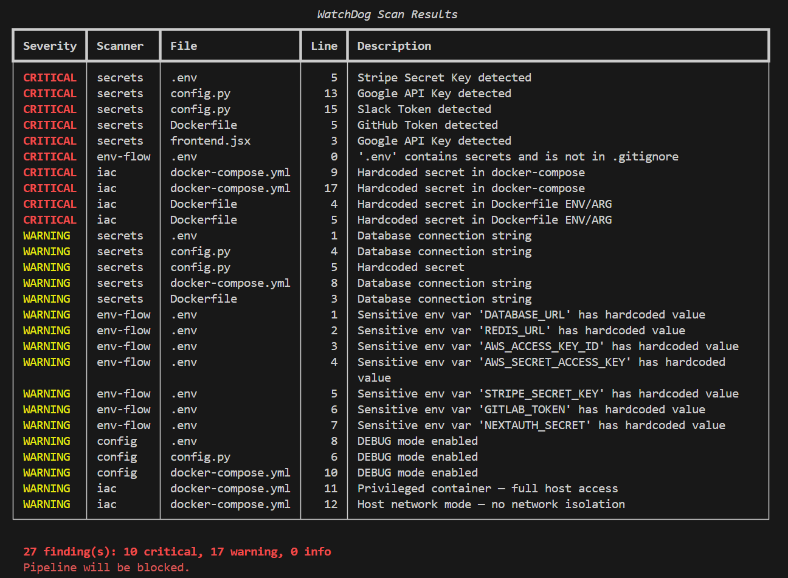
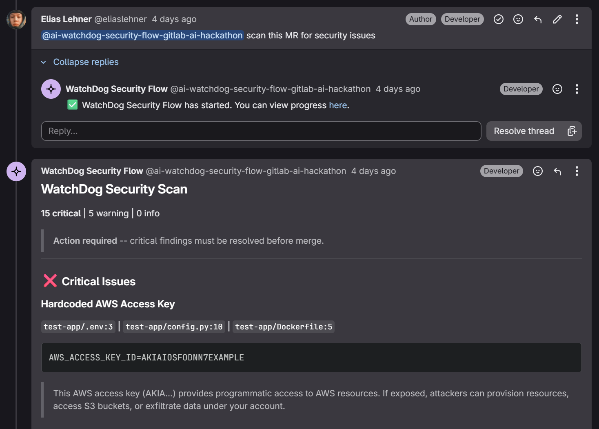

# WatchDog

A security scanner that catches leaked credentials, client-side secret exposure, and misconfigurations before deployment. Uses Claude for contextual reasoning about whether findings are actually exploitable.

Built for the **GitLab AI Hackathon 2026** (Security & Compliance category). Works locally without GitLab access.

---

## Problem

Secret scanners pattern-match strings in git commits. They don't understand context. A `DATABASE_URL` in a server file is fine — until a bad import pulls it into a public JS bundle. WatchDog catches that by reasoning about the framework, the file's role, and the deployment target.

## What gets scanned

| Scanner | What's checked |
|---|---|
| `secrets` | AWS keys, GitHub/GitLab tokens, Google API keys, Stripe keys, private keys, passwords, JWTs, connection strings |
| `client-exposure` | Server secrets referenced in client-side code, sensitive env vars with `NEXT_PUBLIC_`/`VITE_`/`REACT_APP_` prefixes |
| `env-flow` | `.env` files not in `.gitignore`, hardcoded secrets in env files, real secrets leaked in `.env.example` |
| `config` | `DEBUG=True`, `NODE_ENV=development`, CORS wildcards, permissive security headers |
| `iac` | Terraform, Docker, docker-compose, k8s manifests — hardcoded creds, privileged containers, open security groups |
| `dependencies` | Known malicious npm packages (event-stream, colors, etc.), unpinned/wildcard versions |
| `artifacts` | Secrets in build output (`.next/`, `dist/`), source maps exposing code, `.env` files in build dirs |

## Severity levels

- **Critical** — pipeline blocked, deploy halted (e.g. hardcoded AWS key, malicious dependency)
- **Warning** — MR comment with the exploit path explained (e.g. DEBUG=True, privileged container)
- **Info** — logged in the report, does not block (e.g. loosely pinned deps, source maps)

## Claude reasoning

When `ANTHROPIC_API_KEY` is set, WatchDog sends findings to Claude for contextual analysis. Claude can:

- **Upgrade** severity when a finding is trivially exploitable in the detected framework
- **Downgrade** severity when framework protections make a finding safe
- **Explain** the exploit path — not just "key found", but why it's dangerous
- **Flag false positives** (e.g. test fixtures, placeholder values)

Skip with `--no-reasoning` for faster scans without API calls.

---

## Quick start

```bash
git clone https://github.com/eliaslehner/WatchDog.git
cd WatchDog

python -m venv .venv
source .venv/bin/activate

pip install -r requirements.txt

# Optional: add your API key for Claude reasoning
cp .env.example .env
# Edit .env and add your ANTHROPIC_API_KEY
```

### Run a scan

```bash
# Scan a local project directory
python watchdog.py scan ./path/to/your/project

# Skip Claude reasoning (no API key needed)
python watchdog.py scan ./my-app --no-reasoning

# Auto-detect framework, or specify it
python watchdog.py scan ./my-app --framework nextjs

# Specify deployment target for context-aware reasoning
python watchdog.py scan ./my-app --target vercel

# Run specific scanners only
python watchdog.py scan ./my-app --scanners secrets,client-exposure,iac

# Exclude directories
python watchdog.py scan . --exclude tests --exclude fixtures

# Verbose output with context and reasoning per finding
python watchdog.py scan ./my-app --no-reasoning --verbose

# Output formats
python watchdog.py scan ./my-app --output json
python watchdog.py scan ./my-app --output gitlab       # MR comment markdown
python watchdog.py scan ./my-app --output codequality  # GitLab Code Quality JSON

# List available scanners
python watchdog.py list-scanners
```

### Exit codes

| Code | Meaning |
|------|---------|
| `0` | No critical findings |
| `1` | Critical findings — pipeline should block |
| `2` | Invalid arguments (e.g. unknown scanner name) |

### Tests

```bash
pytest tests/ -v
```

68 tests covering all 7 scanners, Claude reasoning, reporters, and end-to-end CLI flows. Test fixtures in `tests/fixtures/` contain an intentionally vulnerable sample project.

---

## Screenshots

<table>
  <tr>
    <td align="center" width="50%">
      
      <br/>
      <strong>CLI output:</strong> findings table grouped by severity, with scanner, file, line, and description. 27 findings detected across the sample project; pipeline blocked on 10 critical issues.
    </td>
    <td align="center" width="50%">
      
      <br/>
      <strong>GitLab MR comment:</strong> WatchDog posts a formatted security report directly on the merge request, blocking merge on critical findings and explaining the exploit path per issue.
    </td>
  </tr>
</table>

---

## Architecture

```
python watchdog.py scan ./project
         |
         v
+---------------------+
|     Orchestrator     |  framework auto-detection, deduplication
+---------+-----------+
          | runs
    +-----+------+------+------+------+------+------+
    |     |      |      |      |      |      |      |
    v     v      v      v      v      v      v      v
 secrets  client  env   config  iac   deps  artifacts
 scanner  exposr  tracer checker scnr  chkr  inspector
    |     |      |      |      |      |      |
    +-----+------+------+------+------+------+
          |
          v
+---------------------+
|   Claude reasoning   |  exploitability analysis (optional)
|   (Anthropic API)    |  severity upgrade/downgrade
+---------+-----------+
          |
    +-----+-----+----------+
    |           |            |
    v           v            v
  console    gitlab MR    codequality
  (table/    (markdown     (JSON for
   verbose)   comment)      CI/CD)
```

## Project structure

```
watchdog/
├── watchdog.py               # CLI entrypoint (Click)
├── orchestrator.py           # Coordinates agents, deduplicates, framework detection
├── models.py                 # Finding dataclass, Severity enum
├── agents/
│   ├── base.py               # BaseAgent ABC — file walking, line reading
│   ├── secret_scanner.py     # Regex-based secret detection (high/medium confidence)
│   ├── client_exposure.py    # Framework-aware client-side exposure checks
│   ├── env_tracer.py         # .env file analysis and gitignore validation
│   ├── config_checker.py     # Debug flags, CORS, security header checks
│   ├── iac_scanner.py        # Docker, Terraform, k8s misconfiguration detection
│   ├── dep_checker.py        # Malicious packages, unpinned dependency checks
│   └── artifact_inspector.py # Build output and source map scanning
├── reasoning/
│   └── claude_client.py      # Anthropic API — batched exploitability analysis
├── reporters/
│   ├── console.py            # Rich table + verbose panel output
│   ├── gitlab_mr.py          # MR comment markdown formatter
│   └── pipeline.py           # Exit codes + GitLab Code Quality JSON
├── tests/
│   ├── fixtures/             # Intentionally vulnerable sample project
│   └── test_*.py             # 68 tests
├── .gitlab-ci.yml            # CI/CD pipeline (test + scan + codequality)
├── .env.example
├── requirements.txt
└── README.md
```

---

## GitLab CI/CD integration

The included `.gitlab-ci.yml` provides three jobs:

1. **test** — runs `pytest` on every MR and push to main
2. **watchdog-scan** — scans the project, blocks pipeline on critical findings
3. **watchdog-codequality** — generates a Code Quality report artifact for MR diffs

### Setup

1. Set `ANTHROPIC_API_KEY` as a masked CI/CD variable in GitLab project settings
2. Optionally set `SCAN_PATH`, `DEPLOY_TARGET`, `WATCHDOG_OUTPUT`
3. Push — the pipeline runs automatically

### Standalone CI snippet

```yaml
watchdog-scan:
  stage: pre-deploy
  image: python:3.11-slim
  before_script:
    - pip install -q -r requirements.txt
  script:
    - python watchdog.py scan . --target $DEPLOY_TARGET --output gitlab
  variables:
    ANTHROPIC_API_KEY: $ANTHROPIC_API_KEY
  rules:
    - if: '$CI_COMMIT_BRANCH == "main"'
    - if: '$CI_PIPELINE_SOURCE == "merge_request_event"'
  allow_failure: false
```

---

## Hackathon

- **Event:** GitLab AI Hackathon 2026
- **Category:** Security & Compliance agents
- **Repo:** *(add when GitLab access is granted)*
- **Demo video:** *(add before submission)*

### Requirements

- Python 3.10+
- Anthropic API key (optional — only for Claude reasoning)

## License

MIT — see [LICENSE](LICENSE)
